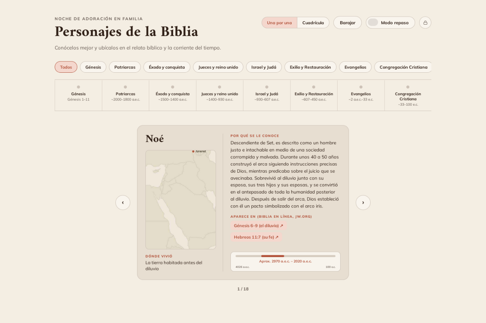
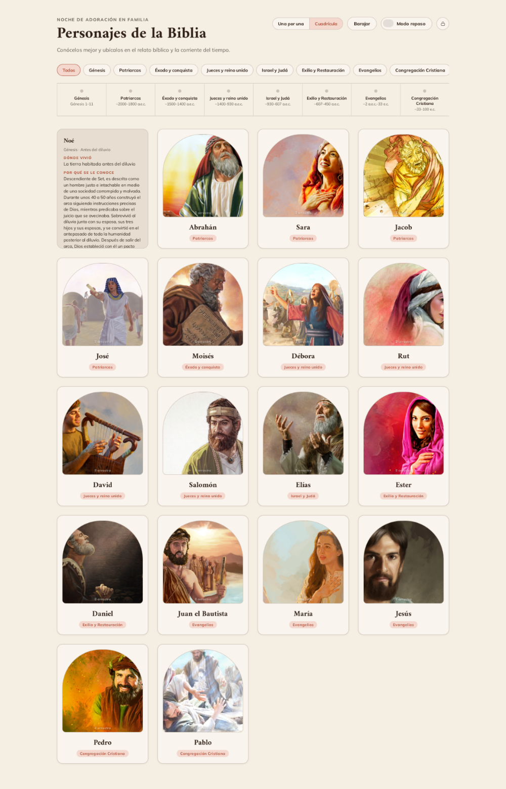
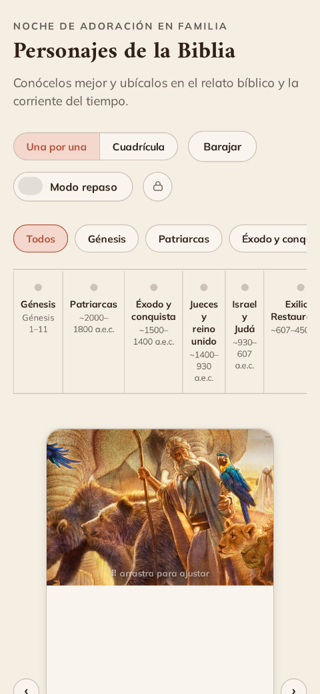
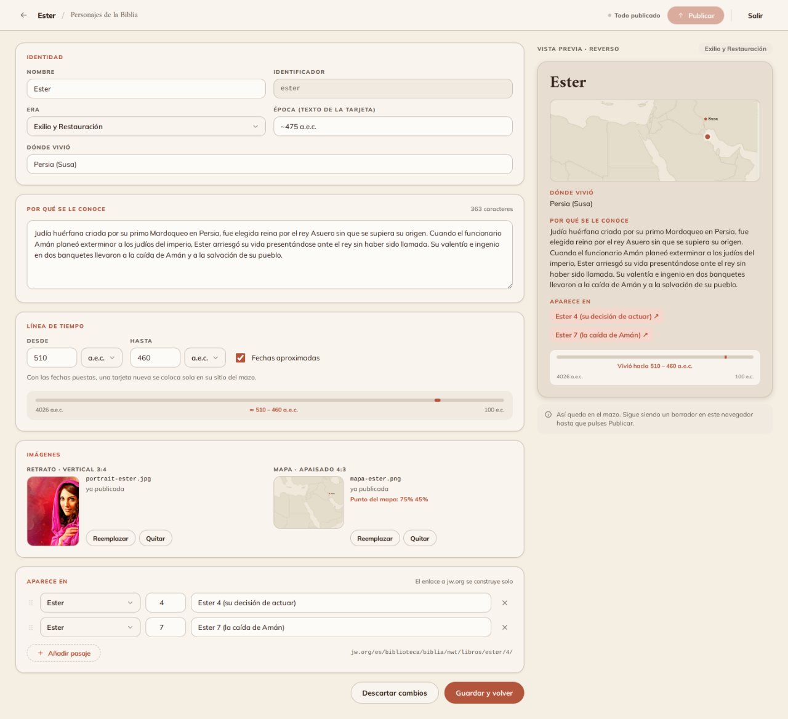
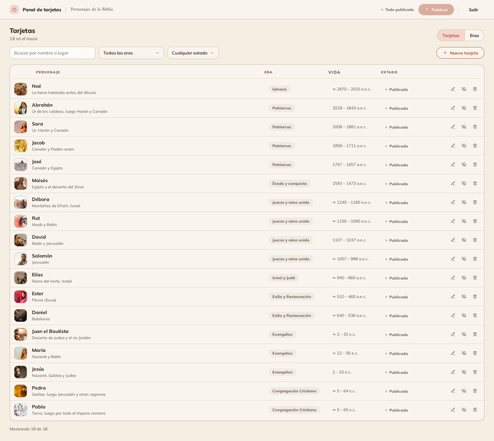

# Personajes de la Biblia

Un mazo de tarjetas para la **noche de adoración en familia**: 18 personajes bíblicos
que se pueden hojear de uno en uno o ver en cuadrícula, con su mapa, los pasajes donde
aparecen y su lugar en la línea del tiempo.

Web estática servida por GitHub Pages. Sin servidor, sin base de datos y sin paso de
compilación: se abre `index.html` y funciona.



## Qué hace

- **Dos vistas del mazo**: una tarjeta a la vez, o todas en cuadrícula.
- **Anverso y reverso**: el nombre y la época delante; detrás, dónde vivió, por qué se
  le conoce, los pasajes enlazados a la Biblia en línea de jw.org y una barra que sitúa
  su vida entre 4026 a. e. c. y 100 e. c.
- **Modo repaso**: oculta los nombres para adivinar quién es antes de darle la vuelta.
- **Filtro por eras** y barajado.
- **Retratos reencuadrables**: se arrastra la foto dentro de la tarjeta para ajustar el
  encuadre; el ajuste se recuerda en ese navegador.
- **Panel de administración** para añadir, editar y ocultar tarjetas sin tocar el código.

<p align="center">
  
  
</p>

## Cómo está montado

```
index.html          el mazo entero: plantilla y lógica en un archivo
support.js          runtime de Claude Design (el mazo es un componente .dc)
admin.html          panel de administración
admin/*.js          módulos del panel (sin framework, sin compilar)
data/*.json         los datos: personajes, eras y libros de la Biblia
assets/             retratos y mapas
docs/               especificaciones, planes y el manual del panel
```

El mazo se dibujó en [Claude Design](https://claude.ai/design) y se importó tal cual,
por eso `index.html` es un componente `.dc` en vez de HTML corriente. El panel, en
cambio, es JavaScript plano con módulos ES que el navegador carga directamente.

### Los datos

Los personajes vivían dentro de `index.html` hasta que el panel los sacó a
`data/*.json`, que es lo que el panel escribe:

- **`data/characters.json`** — los personajes. Cada uno lleva su era, su época, dónde
  vivió, el texto de "por qué se le conoce", las rutas de su retrato y su mapa, las
  fechas de vida y los pasajes.
- **`data/eras.json`** — las ocho eras, que ordenan el mazo y los filtros.
- **`data/books.json`** — los 66 libros con su nombre, su fragmento de URL en jw.org y
  cuántos capítulos tiene cada uno. Los enlaces a los pasajes se construyen a partir de
  aquí, en vez de guardarse ya escritos.

Una tarjeta con `"hidden": true` sigue en los datos pero no aparece en el mazo.

## Añadir o editar tarjetas

Desde el propio sitio, con el botón del candado de la cabecera. El panel guarda un
borrador en el navegador y no toca la web hasta pulsar **Publicar**, que escribe un
único commit en `main` mediante la API de GitHub; Pages reconstruye en un minuto.

Hace falta un token de GitHub acotado a este repositorio. **[Manual completo en
`docs/panel.md`](docs/panel.md)**.





## Trabajar en local

No hay dependencias que instalar. Basta con servir la carpeta por HTTP — los datos se
cargan con `fetch`, así que abrir el archivo directamente con `file://` no funciona:

```
npx http-server . -p 8080
```

## Contenido

Los textos y las fechas se apoyan en publicaciones de jw.org (*Ejemplos de fe*,
*Seamos valientes al andar con Dios* y *Perspicacia*). Los PDF de consulta están
excluidos del repositorio a propósito.

Los retratos y los mapas son ilustraciones de apoyo, no reconstrucciones históricas.
